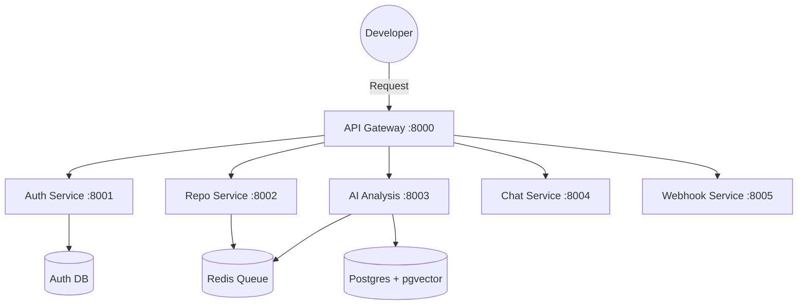

# ⚡ GitPro
### **The AI-Powered GitHub Companion Platform**

[](https://go.dev/)
[](https://microservices.io/)
[](https://deepmind.google/technologies/gemini/)
[](https://github.com/pgvector/pgvector)

**GitPro** is a high-performance microservices platform designed to revolutionize how developers interact with their codebases. By combining **LLMs**, **Vector Search**, and **GitHub Integration**, it provides deep insights, security scanning, and context-aware chat.

---

## 🏗️ System Architecture

GitPro is built on a distributed microservices mesh. All traffic flows through the **Central Gateway** to specialized background workers.



---

## 🛠️ Tech Stack

| Layer | Technology |
| :--- | :--- |
| **Backend** | Go 1.21 (Fiber Framework) |
| **AI Engine** | Google Gemini Pro |
| **Vector Search** | pgvector (PostgreSQL) |
| **Task Queue** | Redis |
| **Containerization** | Docker & Docker Compose |
| **Frontend** | *Planned: Next.js 14 + Tailwind (Cyberpunk UI)* |

---

## 🚀 Quick Start

### 1. Environment Configuration
Clone the repository and set up your environment:
```bash
cp .env.example .env
```
Update `.env` with your credentials:
- `GITHUB_CLIENT_ID` / `SECRET` (from GitHub Developer Settings)
- `GEMINI_API_KEY` (from Google AI Studio)
- `JWT_SECRET` (Your secure signing key)

### 2. Launch the Platform
Bring up the entire ecosystem with a single command:
```bash
docker-compose up --build
```
*This spins up 6 microservices, 5 PostgreSQL instances, and Redis.*

### 3. Verify Health
```bash
# Check overall gateway health
curl http://localhost:8000/health
```

---

## 🔌 API Reference

### 🔐 Authentication
| Method | Endpoint | Description |
| :--- | :--- | :--- |
| `GET` | `/api/auth/github` | Initiate GitHub OAuth |
| `GET` | `/api/auth/me` | Get current user profile |
| `POST` | `/api/auth/logout` | Invalidate session |

### 📂 Repository & AI
| Method | Endpoint | Description |
| :--- | :--- | :--- |
| `GET` | `/api/repos` | List synced repositories |
| `POST` | `/api/repos/:id/sync` | Force sync with GitHub |
| `POST` | `/api/repos/:id/analyze` | Trigger AI code analysis |
| `GET` | `/api/analysis/:id` | Retrieve security/quality report |

### 💬 Chat (Repo-Aware)
| Method | Endpoint | Description |
| :--- | :--- | :--- |
| `POST` | `/api/chat/sessions` | Create a new AI chat context |
| `POST` | `/api/chat/message` | Ask AI about your code |

---

## 🔄 Data Flow Logic

1.  **Ingestion:** User connects a repo. The `Repo Service` clones and metadata-indexes it.
2.  **Processing:** `AI Service` reads the files, generates embeddings via Gemini, and stores them in `pgvector`.
3.  **Intelligence:** When you ask a question, the `Chat Service` performs a **Similarity Search** in the vector DB to find relevant code snippets and sends them to Gemini for a context-aware answer.
4.  **Real-time:** `Webhook Service` listens for new commits to automatically re-trigger analysis.

---

## 📂 Project Structure

```text
gitpro/
├── services/
│   ├── api-gateway/      # Entry point & Routing
│   ├── auth-service/     # OAuth & JWT
│   ├── repo-service/     # GitHub API & Metadata
│   ├── ai-service/       # Embeddings & Analysis
│   ├── chat-service/     # RAG & Conversations
│   └── webhook-service/  # Event Processing
├── docker-compose.yml    # Full stack orchestration
└── .env.example          # Template for secrets
```

---

## 🗺️ Roadmap

- [x] **Phase 1:** Core Microservices & Go-Fiber implementation.
- [x] **Phase 2:** AI Integration (Gemini) & Vector Search.
- [x] **Phase 3:** Frontend Launch (Next.js Cyberpunk Dashboard).
- [ ] **Phase 4:** Distributed Tracing (Jaeger) & Service Mesh.

---

## 🤝 Contributing
1. Fork the project
2. Create your Feature Branch (`git checkout -b feature/AmazingFeature`)
3. Commit changes (`git commit -m 'Add some AmazingFeature'`)
4. Push to the Branch (`git push origin feature/AmazingFeature`)
5. Open a Pull Request

---

## 📄 License
Distributed under the **MIT License**. See `LICENSE` for more information.

---
**Built with 💙 for the developer community.**
