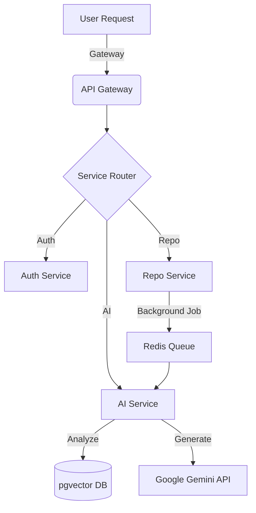

# 🐦‍🔥 GitPro
### **The AI-Powered GitHub Companion Platform**

[](https://www.python.org/)
[](https://fastapi.tiangolo.com/)
[](https://deepmind.google/technologies/gemini/)
[](https://github.com/pgvector/pgvector)

**GitPro** is an advanced AI-driven ecosystem designed to transform how you interact with GitHub. It leverages Python's powerful AI library ecosystem to provide code analysis, vulnerability detection, and repository-aware conversations.

---

## 🏗️ Microservices Architecture

GitPro runs on a distributed network of 6 Python services. Each service is isolated, scalable, and specialized:

| Service | Port | Description |
| :--- | :--- | :--- |
| **🚀 API Gateway** | `8000` | Central entry point & request routing. |
| **🔐 Auth Service** | `8001` | GitHub OAuth2 & JWT session management. |
| **📦 Repo Service** | `8002` | Metadata sync & GitHub API orchestration. |
| **🧠 AI Service** | `8003` | Embeddings generation & security scanning. |
| **💬 Chat Service** | `8004` | RAG-based (Retrieval) conversational AI. |
| **⚓ Webhook Service** | `8005` | Real-time event processing for push/pulls. |

---

## 🛠️ Tech Stack

*   **Language:** Python 3.10+ (Asynchronous)
*   **AI Engine:** Google Gemini AI (via `google-generativeai`)
*   **Vector Database:** PostgreSQL with `pgvector` extension
*   **Task Queue:** Redis for background analysis processing
*   **Containerization:** Docker & Docker Compose
*   **Frontend (Planned):** Next.js 14 with a Cyberpunk UI

---

## 🚀 Quick Start

### 1. Configure Environment
Clone the repo and set up your secrets:
```bash
cp .env.example .env
```
Add your credentials to `.env`:
- `GITHUB_CLIENT_ID` / `SECRET`
- `GEMINI_API_KEY`
- `JWT_SECRET`

### 2. Launch the Ecosystem
Use Docker Compose to spin up all 6 services and the required databases:
```bash
docker-compose up --build
```

### 3. Verify System Health
```bash
# Check the Gateway
curl http://localhost:8000/health

# Check the AI Engine
curl http://localhost:8003/health
```

---

## 📡 API Endpoints

### 🔐 Authentication
`GET /api/auth/github` — Login with GitHub  
`GET /api/auth/me` — Get current user session  

### 📂 Repository Management
`GET /api/repos` — List all synced repositories  
`POST /api/repos/:id/sync` — Manually trigger GitHub sync  
`POST /api/repos/:id/analyze` — Run AI Security & Quality audit  

### 💬 AI Chat
`POST /api/chat/message` — Ask questions about your code (e.g., *"Where is the auth logic?"*)

---

## 🧠 How it Works (Data Flow)



---

## 📂 Project Structure
```text
gitpro/
├── services/
│   ├── api-gateway/      # Entry point (Nginx/FastAPI)
│   ├── auth-service/     # Identity & OAuth
│   ├── repo-service/     # GitHub API Logic
│   ├── ai-service/       # Vectorizing & Analysis
│   ├── chat-service/     # Conversation Logic
│   └── webhook-service/  # Event Listeners
├── docker-compose.yml    # Full-stack orchestration
└── .env.example          # Secrets template
```

---

## 🗺️ Roadmap
- [x] **Phase 1:** Python Microservices MVP.
- [x] **Phase 2:** Gemini AI & pgvector integration.
- [x] **Phase 3:** Async background worker tasks via Redis.
- [x] **Phase 4:** Next.js Cyberpunk Dashboard frontend.
- [ ] **Phase 5:** Kubernetes Deployment (Helm Charts).

---

## 🤝 Contributing
Contributions are welcome! Please follow these steps:
1. Fork the Project.
2. Create your Feature Branch (`git checkout -b feature/AmazingFeature`).
3. Commit your Changes (`git commit -m 'Add some AmazingFeature'`).
4. Push to the Branch (`git push origin feature/AmazingFeature`).
5. Open a Pull Request.

---
**Built with 🐍 and 🤖 for the next generation of developers.**
