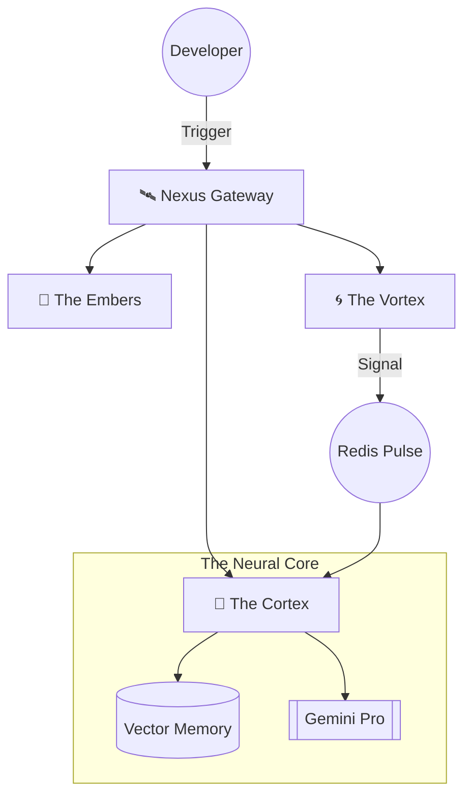

# 🐦‍🔥 GitPro
### **Ignite Your Codebase with Neural Intelligence**

[](https://www.python.org/)
[](https://deepmind.google/technologies/gemini/)
[](https://github.com/pgvector/pgvector)
[](https://github.com/)

**GitPro Phoenix** is a sentient microservices ecosystem that breathes life into static repositories. Like its namesake, it identifies the "ashes" of legacy code, security vulnerabilities, and technical debt, allowing your project to rise reborn through **Advanced Neural Analysis** and **Autonomous AI Reasoning**.

---

## 🏗️ The Phoenix Protocol (Microservices)

The system is powered by six high-frequency Python nodes, interconnected via an asynchronous neural mesh:

| Node | Alias | Function |
| :--- | :--- | :--- |
| 🛰️ **The Nexus** | `Gateway` | Orchestrates the flow of data across the internal mesh. |
| 🔐 **The Embers** | `Auth` | Secure biometric-style JWT & GitHub OAuth signatures. |
| 🌀 **The Vortex** | `Repo` | Ingesting raw repository streams into the system. |
| 🧠 **The Cortex** | `AI` | The Phoenix's brain—generating vector embeddings & security scans. |
| 💬 **The Oracle** | `Chat` | A repository-aware entity that speaks the language of your code. |
| 📡 **The Pulse** | `Webhook` | Sensing every heartbeat (commit/push) in real-time. |

---

## 🧪 Genetic Tech Stack

*   **Core Engine:** Asynchronous Python (FastAPI) — Fast, resilient, and non-blocking.
*   **Neural Vision:** Google Gemini Pro — Deep-context reasoning for complex logic.
*   **Total Recall:** `pgvector` — High-dimensional vector search to find code by "feeling," not just keywords.
*   **The Adrenaline:** Redis — Powering the background task-queue for heavy lifting.
*   **The Vessel:** Docker — Immutable containerization for seamless deployment.

---

## 🚀 Ignition Sequence (Setup)

### 1. Synchronize the Core
Initialize your environmental matrix:
```bash
cp .env.example .env
```
*Inject your GitHub Credentials and Gemini API Keys to wake the Phoenix.*

### 2. Initiate Lift-off
Summon the entire microservice fleet:
```bash
docker-compose up --build -d
```
*This command materializes the infrastructure: 6 Services, 5 Neural Databases, and the Redis Pulse.*

### 3. Bio-Scan (Health Check)
```bash
# Verify the Nexus is online
curl http://localhost:8000/health
```

---

## 📡 Cognitive Capabilities

### 🔎 Deep Scanning
Ask the Phoenix to audit your security posture:
`POST /api/repos/:id/analyze`  
*Scans for vulnerabilities and architectural rot in the shadows of your code.*

### 💬 Neural Conversation
Dialogue with your repository:
`POST /api/chat/message`  
**Query:** *"Where is the vulnerability in my authentication flow?"*  
**Phoenix:** *"The identity logic at `auth.py:42` lacks salt... let me rewrite that for you."*

### ⚡ Semantic Retrieval
Find code based on intent:
`GET /api/embeddings/search?q="async database connection"`

---

## 🧠 System Architecture



---

## 📂 Internal Anatomy
```text
gitpro-phoenix/
├── services/
│   ├── api-gateway/      # Entry & Routing
│   ├── auth-service/     # Identity & Security
│   ├── repo-service/     # GitHub Streamer
│   ├── ai-service/       # Neural Processing
│   ├── chat-service/     # RAG & LLM Logic
│   └── webhook-service/  # Event Monitor
├── docker-compose.yml    # The Orchestrator
└── .env.example          # Core Secrets
```

---

## 🗺️ The Evolution Path

- [x] **Genesis:** Microservice Mesh Architecture.
- [x] **Ignition:** Gemini AI & Vector Memory integration.
- [x] **Ascension:** Cyberpunk Dashboard with 3D code visualizations.
- [ ] **Singularity:** Self-healing code generation & PR automation.

---

## 🤝 Join the Rebirth
We welcome all code-alchemists.
1. **Fork** the repository.
2. **Branch** into a new feature (`git checkout -b feature/PhoenixRise`).
3. **Ignite** your changes and **Push**.

---
**Built with 🐍. Reborn through 🐦‍🔥. Destined for 🌌.**
