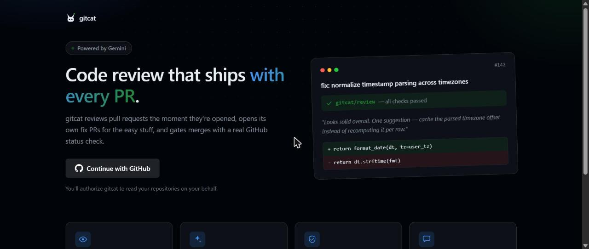
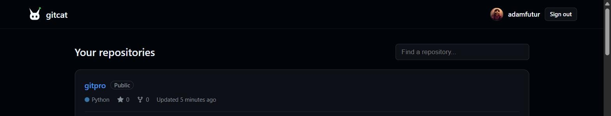
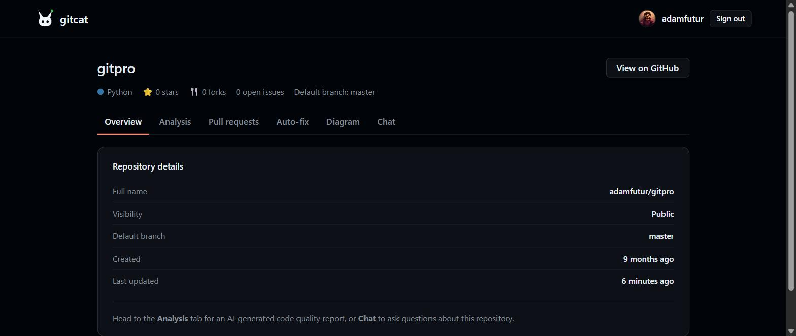
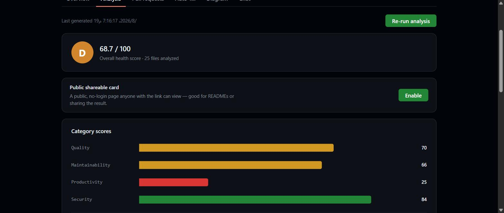
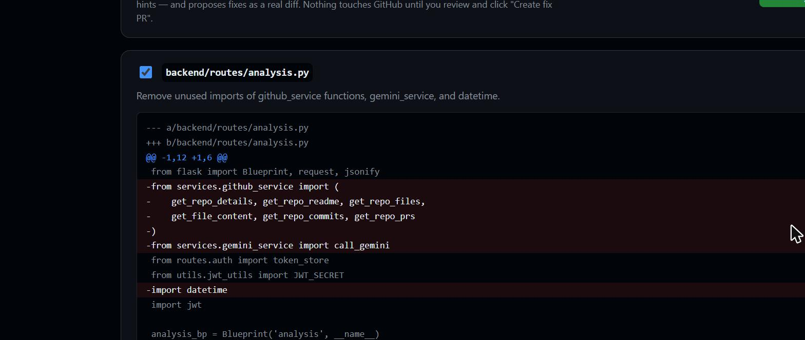
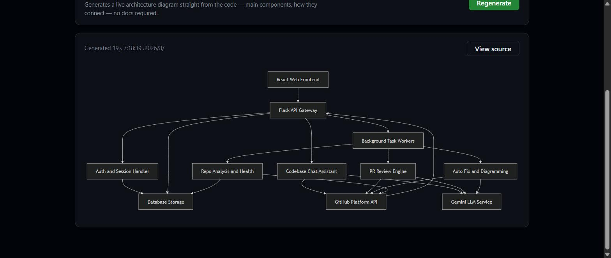
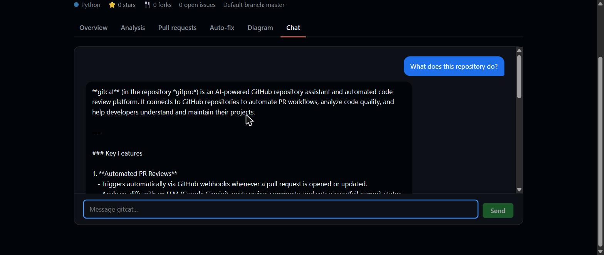
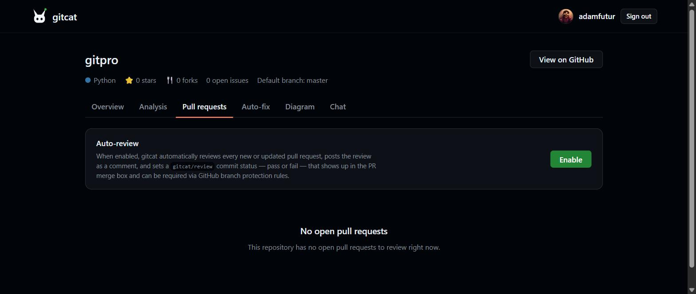
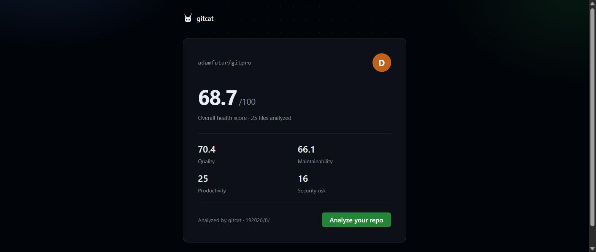

<p align="center">
  
</p>

<h1 align="center">gitcat</h1>

**Code review that ships with every PR.**

Most review bots wait to be asked. gitcat doesn't. It's watching your pull requests the second they open,
reading the diff, leaving a real review, and setting a status check your branch protection can actually
enforce — while you go make coffee.

> Open a PR → gitcat reads it → comments like a reviewer would → passes or blocks the check → you merge
> with confidence instead of hope.

<p align="center">
  
</p>

## What it actually does

Sign in with GitHub, point it at a repo, and let it work:

🔍 **Reviews every PR, unprompted** — a webhook fires the moment a PR opens or gets pushed to. gitcat reads
the diff, writes a real review comment, and sets a `gitcat/review` commit status: pass or fail, no vibes.
Wire it into branch protection and nothing merges without a look-over.

🩹 **Fixes the boring stuff itself** — scans for the kind of issues nobody enjoys fixing (hardcoded local
paths, unsafe `pickle` loads, missing type hints, dead imports), then opens its own PR with the patch.
Review the diff, click merge, move on.

🗺️ **Draws the map** — turns a pile of source files into a Mermaid diagram of how the repo actually fits
together, so the tenth person to join the project doesn't have to reverse-engineer it from scratch.

📊 **Scores repo health** — quality, maintainability, productivity, security — plus anomaly flags, tracked
over time so you can watch a repo trend up or down instead of guessing.

💬 **Answers questions about the codebase** — ask it something and it goes and reads the README, the files,
the commit history, or open PRs to figure out the answer, instead of hallucinating one.

🔗 **Shows off the good stuff, publicly** — flip on a share link and anyone gets a clean, read-only health
card for the repo. No source, no login, just the badge-worthy numbers.

## See it in action

Real screenshots, running locally against a real repo — no mockups.

<table>
<tr>
<td width="50%"><br/><sub><b>Dashboard</b> — every repo you have access to, one click away</sub></td>
<td width="50%"><br/><sub><b>Overview</b> — the basics, plus a nudge toward Analysis and Chat</sub></td>
</tr>
<tr>
<td width="50%"><br/><sub><b>Analysis</b> — a health score and category breakdown, generated live</sub></td>
<td width="50%"><br/><sub><b>Auto-fix</b> — a real diff, found and proposed automatically</sub></td>
</tr>
<tr>
<td width="50%"><br/><sub><b>Diagram</b> — this repo's own architecture, mapped by gitcat, of gitcat</sub></td>
<td width="50%"><br/><sub><b>Chat</b> — grounded answers, not guesses</sub></td>
</tr>
<tr>
<td width="50%"><br/><sub><b>Pull requests</b> — one switch turns on review-on-every-PR</sub></td>
<td width="50%"><br/><sub><b>Share card</b> — the public, no-login version of the score</sub></td>
</tr>
</table>

## How it's built

A Flask API (`backend/`) and a React + TypeScript + Vite frontend (`gitverse-ai/`) — two moving parts, not
twelve. Longer jobs (analysis, review, fix-scanning, diagramming) run in the background and get polled for
status, so the UI never just sits there spinning.

```
backend/            Flask app, one blueprint per feature (auth, repos, pulls,
                     webhooks, fixes, diagrams, chat, dashboard, share)
gitverse-ai/         React app: login → repo dashboard → per-repo tabs
```

SQLite locally, Postgres in Docker/production. GitHub OAuth for identity, a GitHub webhook for the
auto-review loop, an LLM for everything that requires actually reading code.

## Running it

**Backend**
```bash
cd backend
pip install -r requirements.txt
python app.py                    # http://localhost:3000
```

**Frontend**
```bash
cd gitverse-ai
npm install
npm run dev                      # http://localhost:5190
```

**Environment** — copy `.env.example` to `.env` at the repo root:

| Variable | Unlocks |
| --- | --- |
| `GITHUB_CLIENT_ID`, `GITHUB_CLIENT_SECRET` | Signing in with GitHub |
| `GEMINI_API_KEY` | Analysis, chat, PR review, auto-fix, diagrams |
| `JWT_SECRET` | Session tokens |
| `FRONTEND_URL` | OAuth redirect + CORS |
| `GITHUB_WEBHOOK_SECRET`, `BACKEND_PUBLIC_URL` | The auto-review webhook (needs a public URL — `ngrok` works for local dev) |

The frontend needs its own `VITE_API_URL` pointing at wherever the backend is running.

**Docker**
```bash
cd backend
docker-compose up --build
```

**Deploying** — `render.yaml` at the repo root is a [Render Blueprint](https://render.com/docs/blueprint-spec):
a Flask web service plus a managed Postgres instance. Render dashboard → New → Blueprint → pick this repo.

---

*Built for the PRs nobody got around to reviewing.*
