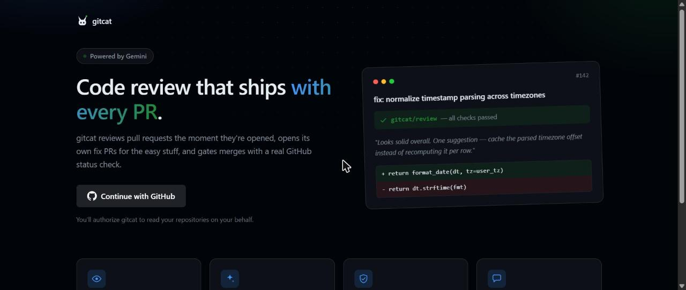
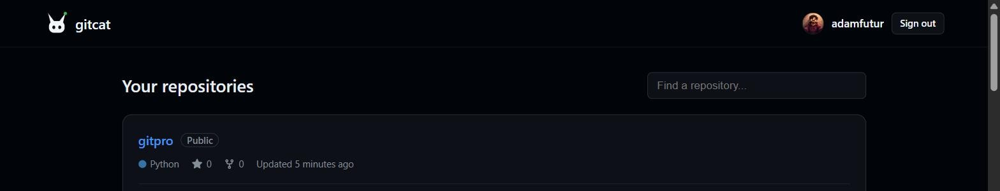
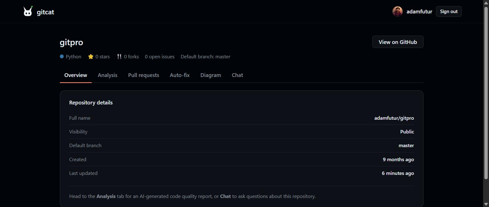
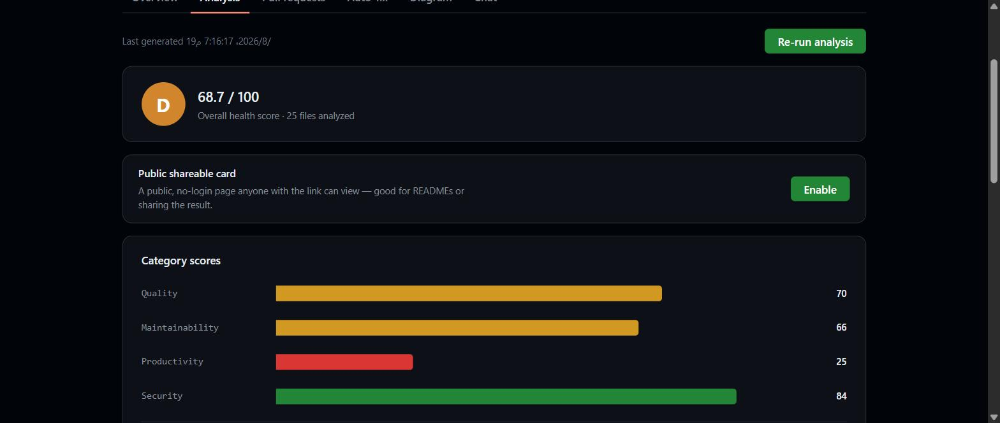
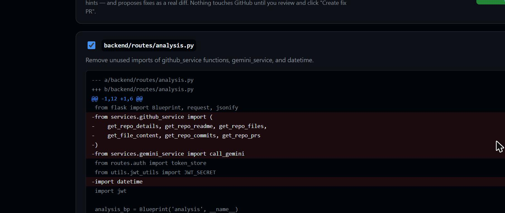
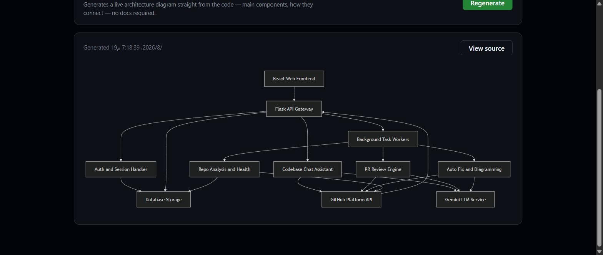
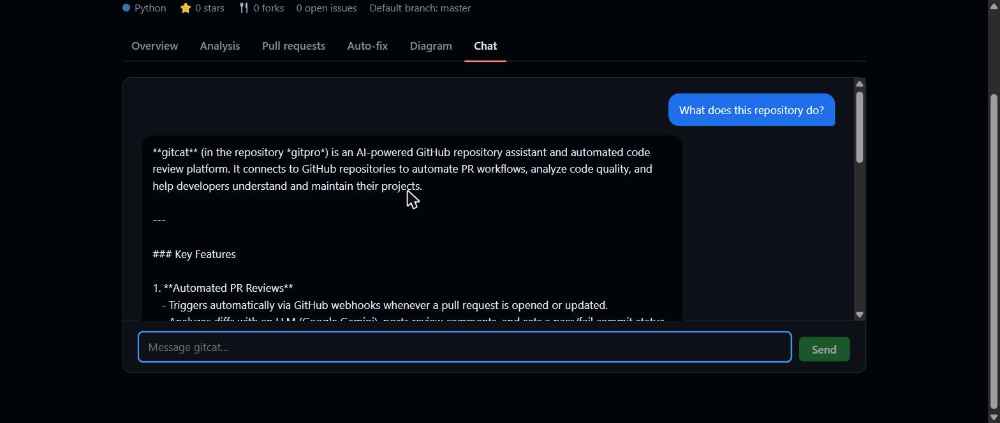
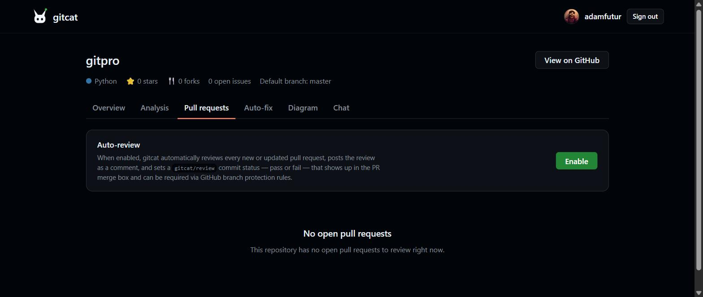
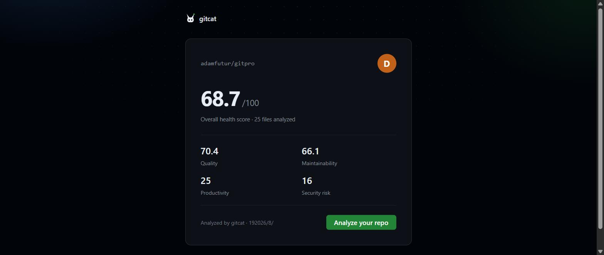

<p align="center">
  
</p>

<h1 align="center">gitcat</h1>

**Code review that ships with every PR.**

Most review bots wait to be asked. gitcat doesn't. It's watching your pull requests the second they open,
reading the diff, leaving a real review, and setting a status check your branch protection can actually
enforce — while you go make coffee.

> Open a PR → gitcat reads it → comments like a reviewer would → passes or blocks the check → you merge
> with confidence instead of hope.

<p align="center">
  
</p>

## What it actually does

Sign in with GitHub, point it at a repo, and let it work:

🔍 **Reviews every PR, unprompted** — a webhook fires the moment a PR opens or gets pushed to. gitcat reads
the diff, writes a real review comment, and sets a `gitcat/review` commit status: pass or fail, no vibes.
Wire it into branch protection and nothing merges without a look-over.

🩹 **Fixes the boring stuff itself** — scans for the kind of issues nobody enjoys fixing (hardcoded local
paths, unsafe `pickle` loads, missing type hints, dead imports), then opens its own PR with the patch.
Review the diff, click merge, move on.

🗺️ **Draws the map** — turns a pile of source files into a Mermaid diagram of how the repo actually fits
together, so the tenth person to join the project doesn't have to reverse-engineer it from scratch.

📊 **Scores repo health** — quality, maintainability, productivity, security — plus anomaly flags, tracked
over time so you can watch a repo trend up or down instead of guessing.

💬 **Answers questions about the codebase** — ask it something and it goes and reads the README, the files,
the commit history, or open PRs to figure out the answer, instead of hallucinating one.

🔗 **Shows off the good stuff, publicly** — flip on a share link and anyone gets a clean, read-only health
card for the repo. No source, no login, just the badge-worthy numbers.

🖥️ **Works from the terminal too** — the new Textual-powered TUI gives you a full interactive GitHub
workspace without opening the web dashboard. Browse repositories, run analysis, inspect pull requests,
generate architecture diagrams, run auto-fix scans, and chat with your codebase.

🤖 **Exposes gitcat through MCP** — the MCP server makes gitcat's repository intelligence available as
MCP tools over stdio. AI clients that support MCP can use the same GitHub-aware capabilities for repository
analysis, PR reviews, auto-fixes, diagrams, and codebase chat.

## See it in action

Real screenshots, running locally against a real repo — no mockups.

<table>
<tr>
<td width="50%"><br/><sub><b>Dashboard</b> — every repo you have access to, one click away</sub></td>
<td width="50%"><br/><sub><b>Overview</b> — the basics, plus a nudge toward Analysis and Chat</sub></td>
</tr>
<tr>
<td width="50%"><br/><sub><b>Analysis</b> — a health score and category breakdown, generated live</sub></td>
<td width="50%"><br/><sub><b>Auto-fix</b> — a real diff, found and proposed automatically</sub></td>
</tr>
<tr>
<td width="50%"><br/><sub><b>Diagram</b> — this repo's own architecture, mapped by gitcat, of gitcat</sub></td>
<td width="50%"><br/><sub><b>Chat</b> — grounded answers, not guesses</sub></td>
</tr>
<tr>
<td width="50%"><br/><sub><b>Pull requests</b> — one switch turns on review-on-every-PR</sub></td>
<td width="50%"><br/><sub><b>Share card</b> — the public, no-login version of the score</sub></td>
</tr>
</table>

## How it's built

A Flask API (`backend/`) and a React + TypeScript + Vite frontend (`gitverse-ai/`) — with a terminal
interface and MCP server layered on top.

Longer jobs (analysis, review, fix-scanning, diagramming) run in the background and get polled for
status, so the web UI never just sits there spinning.

```
backend/
├── Flask API
├── services/          GitHub, AI, analysis, review, auto-fix, diagrams, etc.
├── tui/               Textual terminal interface
│   ├── app.py         TUI application
│   ├── core.py        Shared GitHub/application state
│   ├── commands.py    Command palette
│   └── screens/       Repo, analysis, PR, auto-fix, diagram and chat screens
├── mcp_server.py      MCP server (stdio transport)
└── run_tui.bat        Windows TUI launcher

gitverse-ai/            React + TypeScript + Vite frontend
```

SQLite locally, Postgres in Docker/production. GitHub OAuth handles web authentication, while the TUI
and MCP server can authenticate directly with a GitHub token. Gemini powers the features that require
actually reading and reasoning about code.

## Running it

### Backend

```bash
cd backend
pip install -r requirements.txt
python app.py                    # http://localhost:3000
```

### Frontend

```bash
cd gitverse-ai
npm install
npm run dev                      # http://localhost:5190
```

### Terminal UI

The terminal UI is built with [Textual](https://textual.textualize.io/) and provides an interactive
GitHub workspace directly from your terminal.

The TUI requires:

- `GITHUB_TOKEN` (or `GITHUB_ACCESS_TOKEN`)
- `GEMINI_API_KEY`

From the repository root:

```bash
python backend/tui/main.py
```

Or, on Windows, use the included launcher:

```bat
backend\run_tui.bat
```

The TUI validates your GitHub token before starting and then opens the repository browser.

Available areas include:

- **Repositories** — browse repositories accessible to your GitHub token
- **Analysis** — run AI-powered repository health analysis
- **Pull Requests** — inspect repository pull requests
- **Auto-Fix** — scan for automatically fixable issues and create a fix PR
- **Architecture Diagram** — generate a Mermaid architecture diagram
- **Chat** — ask questions about the repository using grounded GitHub context

The command palette is available with:

```text
Ctrl+P
```

and the application can be exited with:

```text
Ctrl+Q
```

### MCP server

gitcat also exposes its repository intelligence through the
[Model Context Protocol (MCP)](https://modelcontextprotocol.io/).

The server uses **stdio transport**, so it can be launched by an MCP-compatible client as a local
process.

The MCP server requires:

```text
GITHUB_TOKEN
GEMINI_API_KEY
```

Start it directly with:

```bash
cd backend
python mcp_server.py
```

The server exposes tools for:

- Listing accessible GitHub repositories
- Repository health analysis
- Listing pull requests
- AI-powered pull request reviews
- Auto-fix scanning
- Applying auto-fixes by opening a pull request
- Generating Mermaid architecture diagrams
- Chatting with a repository using GitHub-backed context

For example, the server can be started with environment variables set in the shell:

```bash
GITHUB_TOKEN=ghp_... GEMINI_API_KEY=AIza... python backend/mcp_server.py
```

On Windows PowerShell:

```powershell
$env:GITHUB_TOKEN="ghp_..."
$env:GEMINI_API_KEY="AIza..."
python backend\mcp_server.py
```

The MCP server reads `GITHUB_TOKEN` when it starts and uses that token for GitHub operations.

> **MCP client configuration:** configure your MCP-compatible client to launch
> `backend/mcp_server.py` with the required environment variables. The exact configuration format
> depends on the client you use.

## Environment

Copy `.env.example` to `.env` at the repository root:

| Variable | Unlocks |
| --- | --- |
| `GITHUB_CLIENT_ID`, `GITHUB_CLIENT_SECRET` | Signing in with GitHub through the web app |
| `GITHUB_TOKEN` | TUI and MCP GitHub access |
| `GITHUB_ACCESS_TOKEN` | Alternative token name accepted by the TUI |
| `GEMINI_API_KEY` | Analysis, chat, PR review, auto-fix, diagrams |
| `JWT_SECRET` | Web session tokens |
| `FRONTEND_URL` | OAuth redirect + CORS |
| `GITHUB_WEBHOOK_SECRET`, `BACKEND_PUBLIC_URL` | The auto-review webhook (needs a public URL — `ngrok` works for local dev) |

The frontend needs its own `VITE_API_URL` pointing at wherever the backend is running.

### GitHub token

The TUI and MCP server use a GitHub personal access token rather than the browser OAuth flow.

Set it in your environment:

```bash
export GITHUB_TOKEN=ghp_...
```

Or put it in the root `.env` file:

```env
GITHUB_TOKEN=ghp_...
GEMINI_API_KEY=AIza...
```

Keep tokens out of source control.

## Docker

```bash
cd backend
docker-compose up --build
```

## Deploying

`render.yaml` at the repo root is a
[Render Blueprint](https://render.com/docs/blueprint-spec):
a Flask web service plus a managed Postgres instance.

Render dashboard → New → Blueprint → pick this repo.

---

*Built for the PRs nobody got around to reviewing.*
